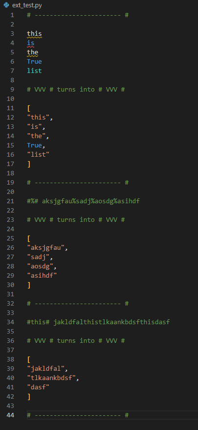

# py-format README

Command to format lines into a python list
https://marketplace.visualstudio.com/items?itemName=ninooe.py-format

## Features

## Requirements

## Extension Settings

This extension contributes the following settings:

* `py-format.listRegex`: regex group 1 will set seperator for lists
* `py-format.listSeperator`: default seperator (default is \\n)
* `py-format.dictRegex`: regex group 1 will set seperator group 2 will assign
* `py-format.dictAssign`: regex group 1 will set seperator for dicts
* `py-format.dictSeperator`: default seperator (default is \\n)

## Known Issues

lines2dict not functional by now

-----------------------------------------------------------------------------------------------------------
